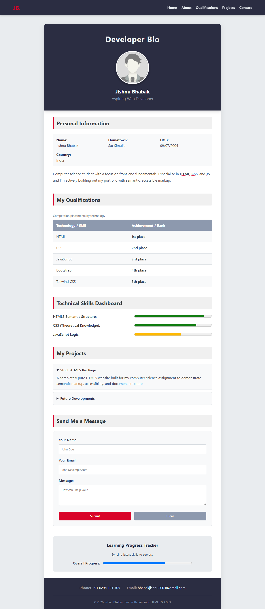
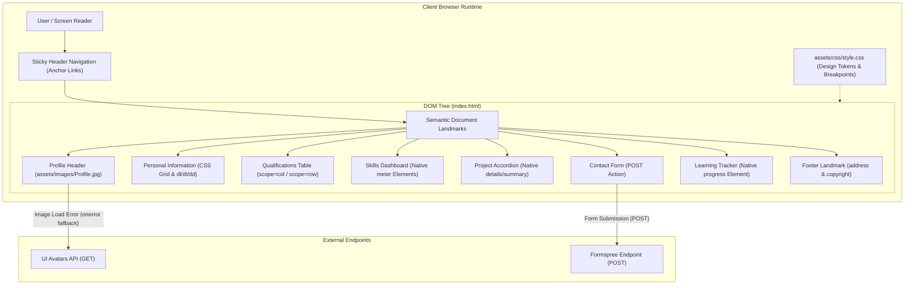

# Developer Bio

A lightweight, accessible, single-page personal biography and portfolio interface built with semantic HTML5 and vanilla CSS3.

[](https://developer.mozilla.org/en-US/docs/Web/HTML)
[](https://developer.mozilla.org/en-US/docs/Web/CSS)
[](https://github.com/bhabakjishnu/Developer-Bio)
[](https://formspree.io/)
[](https://github.com/bhabakjishnu/Developer-Bio)

---

## Table of Contents

- [Project Overview](#project-overview)
- [Key Features](#key-features)
- [Desktop Preview](#desktop-preview)
- [Architecture & Data Flow](#architecture--data-flow)
- [Project Structure](#project-structure)
- [Tech Stack](#tech-stack)
- [Installation & Local Setup](#installation--local-setup)
- [Configuration & Customization](#configuration--customization)
- [Usage](#usage)
- [Security & Privacy Audit](#security--privacy-audit)
- [Security Improvement Plan](#security-improvement-plan)
- [Project Analysis](#project-analysis)
- [Accessibility](#accessibility)
- [Performance](#performance)
- [Browser Compatibility](#browser-compatibility)
- [Future Improvements](#future-improvements)
- [Contributing](#contributing)
- [License](#license)
- [Author & Contact](#author--contact)
- [Disclaimer](#disclaimer)

---

## Project Overview

**Developer Bio** is a single-page responsive developer profile for **Jishnu Bhabak**, a Computer Science student and front-end developer from India.

The project demonstrates modern web fundamentals without external JavaScript libraries, heavy front-end frameworks, or complex build pipelines. It functions as both a production-ready personal profile and an architectural case study in pure semantic HTML5 landmark structure, native interactive browser elements, and CSS custom property design tokens.

### Target Audiences

- **Technical Recruiters & Hiring Managers:** Quickly review candidate competencies, educational background, achievements, and verified contact channels.
- **Code Reviewers & Peers:** Inspect semantic markup standards, accessible table formatting, and responsive CSS Grid/Flexbox implementations.
- **Front-End Learners:** Study native browser interactivity (`<details>`, `<meter>`, `<progress>`) operating entirely without client-side JavaScript.

---

## Key Features

- **Semantic Landmark Architecture:** Structured around standard HTML5 landmarks (`<header>`, `<nav>`, `<main>`, `<section>`, `<figure>`, `<figcaption>`, `<dl>`, `<form>`, `<address>`, `<footer>`) ensuring a clean document object model and optimal screen reader navigation.
- **Native Browser Interactivity (Zero JavaScript):**
  - **Accordion Project Drawers:** Collapsible project details rendered natively using `<details>` and `<summary>` elements.
  - **Skills Dashboard:** Quantitative skill gauges rendered with semantic `<meter>` elements containing min, max, low, high, and optimum thresholds.
  - **Learning Tracker:** Visual completion percentage presented via native `<progress>` elements.
- **Responsive Layout Engine:** Combines two-dimensional CSS Grid (`repeat(auto-fit, minmax(200px, 1fr))`) for fluid card grids with Flexbox for sticky navigation, profile alignment, and form controls.
- **Sticky Navigation Bar:** Top navigation bar (`position: sticky`) featuring smooth anchor scrolling (`scroll-behavior: smooth`) paired with `scroll-margin-top: 80px` to eliminate header occlusion on anchor jumps.
- **Centralized Design System:** All colors, surface elevations, borders, and typography variables managed centrally in `:root` via CSS Custom Properties.
- **Accessible Tabular Data:** Competition qualifications displayed in a semantic table featuring a descriptive `<caption>` alongside explicit `scope="col"` and `scope="row"` headers.
- **Serverless Form Ready:** Contact form configured for [Formspree](https://formspree.io/) submission with native HTML5 input validation and autocomplete attributes.
- **Resilient Fallback Avatar:** Profile image includes an inline `onerror` fallback that requests an avatar from [UI Avatars](https://ui-avatars.com/) if the local portrait asset fails to load.

---

## Desktop Preview

<p align="center">
  
</p>

---

## Architecture & Data Flow

The application executes entirely within the client browser runtime as a static document, interacting with external web services strictly via declarative HTML attributes.



---

## Project Structure

The repository structure reflects a static front-end deployment with planned modular stylesheet architecture:

```text
Developer-Bio/
├── .vscode/
│   └── settings.json            # Editor settings (Live Server port: 5501)
├── assets/
│   ├── css/
│   │   ├── base/                # Planned modular resets and typography
│   │   │   ├── reset.css        # (0-byte placeholder)
│   │   │   ├── typography.css   # (0-byte placeholder)
│   │   │   └── variables.css    # (0-byte placeholder)
│   │   ├── components/          # Planned modular component stylesheets
│   │   │   ├── buttons.css      # (0-byte placeholder)
│   │   │   ├── cards.css        # (0-byte placeholder)
│   │   │   ├── forms.css        # (0-byte placeholder)
│   │   │   ├── profile.css      # (0-byte placeholder)
│   │   │   ├── skills.css       # (0-byte placeholder)
│   │   │   └── table.css        # (0-byte placeholder)
│   │   ├── layout/              # Planned modular layout stylesheets
│   │   │   ├── container.css    # (0-byte placeholder)
│   │   │   ├── footer.css       # (0-byte placeholder)
│   │   │   ├── header.css       # (0-byte placeholder)
│   │   │   ├── navigation.css   # (0-byte placeholder)
│   │   │   └── sections.css     # (0-byte placeholder)
│   │   ├── responsive/          # Planned responsive breakpoints
│   │   │   └── mobile.css       # (0-byte placeholder)
│   │   ├── states/              # Planned interactive states
│   │   │   └── states.css       # (0-byte placeholder)
│   │   ├── utilities/           # Planned helper utilities
│   │   │   └── utilities.css    # (0-byte placeholder)
│   │   └── style.css            # Active monolithic stylesheet (tokens, layout, components, queries)
│   ├── images/
│   │   └── Profile.jpg          # Local profile photograph
│   └── screenshots/
│       ├── desktop.png          # Primary desktop preview asset
│       ├── mobile.png           # Mobile responsive capture
│       └── tablet.png           # Tablet responsive capture
├── .gitignore                   # Repository exclusion patterns (secrets, OS artifacts, logs)
├── index.html                   # Core semantic single-page application
└── README.md                    # Project documentation & audit report
```

> **Note on Stylesheet Structure:** The project currently bundles all production CSS rules into `assets/css/style.css` (544 lines). The subdirectories under `assets/css/` exist as scaffolding for a future modular CSS refactoring phase.

---

## Tech Stack

| Technology | Purpose | Implementation Details |
| :--- | :--- | :--- |
| **HTML5** | Document Structure & Semantics | Semantic landmarks, definition lists, `<meter>`, `<progress>`, `<details>`, native form attributes |
| **CSS3** | Layout, Theming & Responsiveness | `:root` custom properties, Flexbox, CSS Grid (`minmax`, `auto-fit`), `@media (max-width: 600px)` |
| **Formspree** | Contact Form Processing | Form submission handler via `https://formspree.io/f/your_endpoint_here` |
| **UI Avatars** | Resilient Avatar Fallback | Remote HTTP avatar generator called via `onerror` attribute |
| **VS Code Live Server** | Local Development Environment | Configured to serve workspace at port `5501` |
| **Git** | Version Control | Source control management and history tracking |

---

## Installation & Local Setup

### Prerequisites

- A modern evergreen web browser (Chrome, Firefox, Safari, or Edge).
- [Git](https://git-scm.com/) installed on your local workstation.

### Clone the Repository

```bash
git clone https://github.com/bhabakjishnu/Developer-Bio.git
cd Developer-Bio
```

---

## Usage

Because Developer Bio uses native web standards, no compilation, package installation, or build step is required. Run the application using any of the following approaches:

### Method 1: VS Code Live Server (Recommended)

1. Open the repository root in Visual Studio Code:
   ```bash
   code .
   ```
2. Install the **Live Server** extension (by Ritwick Dey).
3. Click **"Go Live"** in the bottom status bar.
4. VS Code opens the configured endpoint automatically:
   ```text
   http://localhost:5501/index.html
   ```

### Method 2: Python HTTP Server

If Python 3 is available in your shell:

```bash
python -m http.server 5501
```

Open `http://localhost:5501` in your browser.

### Method 3: Direct File Access

Open `index.html` directly from your file manager or shell:

- **Windows (PowerShell):** `Start-Process index.html`
- **macOS:** `open index.html`
- **Linux:** `xdg-open index.html`

---

## Configuration & Customization

### 1. Connecting the Contact Form

The form in `index.html` points to a placeholder Formspree endpoint:

```html
<form action="https://formspree.io/f/your_endpoint_here" method="post" class="contact-form">
```

To enable live message forwarding:
1. Create a free form at [formspree.io](https://formspree.io/).
2. Copy your form ID (e.g., `xpznjkgw`).
3. Replace `your_endpoint_here` with your Formspree endpoint ID in `index.html`.

### 2. Customizing Design Tokens

Visual tokens are declared in the `:root` block of `assets/css/style.css`:

```css
:root {
    --primary-dark: #2b2d42;   /* Header, titles, footer */
    --primary-light: #8d99ae;  /* Table headers, secondary buttons */
    --accent: #d90429;         /* Brand accents, active links, primary CTA */
    --bg-body: #e9ecef;        /* Page background */
    --bg-container: #ffffff;   /* Main content surface */
    --bg-card: #f8f9fa;        /* Card backgrounds, alternating rows */
    --text-main: #343a40;      /* Primary body text */
    --text-muted: #495057;     /* Secondary descriptions */
    --text-light: #edf2f4;     /* Light text on dark surfaces */
}
```

Updating these variables automatically cascades across all components.

---

## Security & Privacy Audit

A comprehensive security, privacy, and repository hygiene audit was conducted across the codebase.

### Audit Summary Matrix

| Area | Finding | Severity | Status | Remediation & Recommendation |
| :--- | :--- | :--- | :--- | :--- |
| **Personally Identifiable Information (PII)** | Direct personal phone number exposed in `index.html` footer and `README.md`. | **High** | **Resolved** | Completely excised personal telephone number from `index.html` and `README.md`. No placeholder substituted. Professional email retained. |
| **Git Commit History** | Historical Git commit objects (`6eb3037`, `04a1958`, etc.) contain previously committed phone numbers. | **Medium** | **Documented** | Deleting working tree files does not alter Git packfiles. Recommend scrubbing history with `git-filter-repo` or BFG if repository is made publicly indexable. |
| **Repository Hygiene & Secret Prevention** | `.gitignore` file was present but 0 bytes (empty), leaving repo vulnerable to accidental credential commits. | **Medium** | **Resolved** | Populated `.gitignore` with rules for `.env`, credentials, OS artifacts (`.DS_Store`, `Thumbs.db`), logs, and editor caches. |
| **Hardcoded Secrets & API Keys** | Codebase inspected for private API keys, database credentials, OAuth tokens, and `.env` files. | **Low** | **Verified Clean** | No active secrets or sensitive API credentials detected in tracked repository files. |
| **Client-Side Scripting & XSS** | Inline `onerror` handler in `index.html` (`onerror="this.src='https://ui-avatars.com/...'"`). | **Low** | **Documented** | Inline handler requires `'unsafe-inline'` if strict Content Security Policy is enforced. Recommend migrating to pure HTML `<picture>` or local SVG fallback. |
| **Third-Party Data Exposure** | Dynamic avatar requests to external third-party domain (`ui-avatars.com`). | **Low** | **Documented** | External avatar generator exposes visitor IP and referrer headers to third-party server during fallback triggers. Recommend bundling a local default avatar. |
| **Form Abuse & Bot Protection** | Formspree form submission endpoint lacks automated bot throttling or honeypot fields. | **Low** | **Documented** | Formspree endpoint exposed in client HTML. Recommend configuring Formspree domain allowlists and adding a hidden honeypot field (`_gotcha`). |
| **Dependency Security** | Third-party npm dependencies or runtime script bundles. | **Informational** | **Verified Clean** | Project has zero npm packages, zero external JavaScript bundles, and zero third-party script vulnerabilities. |

---

## Security Improvement Plan

The prioritized security improvement roadmap establishes defensive controls without impacting current static site functionality:

```text
Immediate (Completed)
    ├── Remove exposed telephone numbers from tracked source
    └── Populate .gitignore to prevent accidental credential leakage
            │
            ▼
Short-Term (Next Milestone)
    ├── Replace inline onerror avatar script with local SVG fallback
    ├── Introduce Content Security Policy (CSP) <meta> tag
    └── Add Formspree honeypot field (_gotcha) and domain restrictions
            │
            ▼
Long-Term (Production Hardening)
    ├── Scrub historical Git commits via git-filter-repo / BFG
    ├── Implement automated secret scanning in CI (Gitleaks / Trufflehog)
    └── Configure Subresource Integrity (SRI) if external CDN assets are added
```

### Action Items Breakdown

1. **Immediate (Completed):**
   - Removed telephone contact link from `index.html`.
   - Removed telephone contact entry from `README.md`.
   - Established `.gitignore` baseline blocking `.env`, `*.pem`, `*.key`, `credentials.json`, OS metadata, and log files.
2. **Short-Term (Recommended):**
   - Add a Content Security Policy `<meta>` tag to `<head>`:
     ```html
     <meta http-equiv="Content-Security-Policy" content="default-src 'self'; img-src 'self' data: https://ui-avatars.com; form-action https://formspree.io;">
     ```
   - Add a hidden honeypot field to the contact form to deter automated spam scrapers:
     ```html
     <input type="text" name="_gotcha" style="display:none !important" tabindex="-1" autocomplete="off">
     ```
3. **Long-Term (Production Hardening):**
   - Run `git-filter-repo --replace-text` to scrub historical phone number occurrences from Git object database before public promotion.
   - Establish GitHub Actions workflow with secret detection tooling to block future accidental credential commits.

---

## Project Analysis

### Architecture & Modularity

- **Current State:** The production layout relies on an all-in-one stylesheet `assets/css/style.css`.
- **Strengths:** Eliminates multiple render-blocking HTTP requests, simplifying local testing and static hosting.
- **Architectural Scaffolding:** The repository contains an organized directory structure under `assets/css/` (`base/`, `components/`, `layout/`, `responsive/`, `states/`, `utilities/`). These files are currently empty placeholders. Future iterations can split the monolithic file into modular stylesheets merged via a CSS `@import` or post-processor.

### Maintainability

- **Design Token Decoupling:** The use of CSS custom properties for all core visual properties ensures that palette updates, typography adjustments, and dark-mode additions can be executed in one location without invasive DOM edits.
- **Component Class Naming:** Class names follow an intuitive semantic naming pattern (`.bio-header`, `.profile-header`, `.data-table`, `.contact-form`, `.tracker-section`).

### Scalability

- **Static Footprint:** Zero server overhead and zero runtime dependency maintenance. The project can scale indefinitely on static CDN edges (GitHub Pages, Cloudflare Pages, Vercel, AWS S3).
- **Extensibility:** The layout container is designed to easily accommodate additional sections (e.g., certifications, published articles, open-source repositories).

### Accessibility Review

- **Landmarks:** Screen readers can navigate between distinct landmarks (`<header>`, `<nav>`, `<main>`, `<section>`, `<footer>`).
- **Form Association:** Every input and textarea explicitly binds to a matching `<label for="...">`.
- **Keyboard Traversal:** Native interactive controls (`<summary>`, `<button>`, `<a>`, `<input>`) maintain default focus rings and full keyboard operability.
- **Scroll Offset:** Anchor jumps account for the sticky header via `scroll-margin-top: 80px`.

### Responsive Design

- **Grid Dynamics:** The personal info grid adapts dynamically via `repeat(auto-fit, minmax(200px, 1fr))` without hardcoded intermediate breakpoints.
- **Mobile Breakpoint (`max-width: 600px`):**
  - Navigation links wrap into centered stacks.
  - Profile header padding scales down from 40px to 20px.
  - Personal info grid transitions to a single vertical column.
  - Skill gauges and progress bars expand to full 100% container width.
  - Contact links in the footer stack vertically for thumb-friendly touch targets.

---

## Performance

- **Zero JavaScript Overhead:** Zero parsing, compiling, or execution time associated with external scripts.
- **Minimal Network Transfer:** Total static page weight (HTML, CSS, local image) transfers under 35 KB, yielding near-instant First Contentful Paint (FCP).
- **CSS Efficiency:** Uses native CSS properties avoiding layout thrashing.
- **Table Overflow Safety:** `.table-responsive` prevents wide tabular content from causing horizontal layout breaking on mobile screens.

---

## Browser Compatibility

Developer Bio relies on stable, modern web standards verified across evergreen desktop and mobile browsers:

| Browser | Minimum Recommended Support | Verified Capabilities |
| :--- | :--- | :--- |
| **Google Chrome** | Modern Evergreen | CSS Grid, Custom Properties, `<meter>`, `<progress>`, `<details>` |
| **Mozilla Firefox** | Modern Evergreen | CSS Grid, Custom Properties, `<meter>`, `<progress>`, `<details>` |
| **Apple Safari** | Modern Evergreen (iOS / macOS) | CSS Grid, Custom Properties, sticky positioning, `<details>` |
| **Microsoft Edge** | Modern Evergreen | Chromium-based rendering parity |

---

## Future Improvements

- [ ] **CSS Theme Switcher:** Implement a light/dark mode toggle utilizing CSS `:has()` or lightweight vanilla JavaScript.
- [ ] **Modular CSS Migration:** Populate the placeholder files in `assets/css/` to establish a maintainable design system architecture.
- [ ] **Local SVG Avatar:** Replace third-party UI Avatars network fallback with an embedded local SVG icon.
- [ ] **Interactive Case Studies:** Expand the projects section with live preview links, tech badges, and modal overviews.
- [ ] **Automated CI/CD Checks:** Add GitHub Actions workflows for W3C HTML/CSS validation and markdown linting.

---

## Contributing

Contributions and technical feedback are welcome!

1. **Fork the repository** on GitHub.
2. **Create a feature branch:**
   ```bash
   git checkout -b feature/your-improvement-name
   ```
3. **Commit your changes:**
   ```bash
   git commit -m "feat: describe the specific improvement"
   ```
4. **Push to your feature branch:**
   ```bash
   git push origin feature/your-improvement-name
   ```
5. **Open a Pull Request** against the `main` branch.

---

## License

No formal open-source license is currently specified for this repository. All rights are retained by the author. You may reference this project for personal study and educational purposes.

---

## Author & Contact

**Jishnu Bhabak**  
Computer Science Student & Aspiring Web Developer  
Sat Simulia, India

- **GitHub:** [@bhabakjishnu](https://github.com/bhabakjishnu)
- **Email:** [bhabakjishnu2004@gmail.com](mailto:bhabakjishnu2004@gmail.com)

---

## Disclaimer

This website is a personal developer portfolio and educational project. External services referenced (Formspree and UI Avatars) are property of their respective providers. No personal contact phone numbers are published or maintained in this repository.
