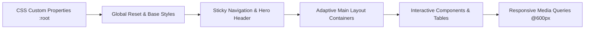

<div align="center">

  # 💼 Developer Bio — Personal Portfolio

  <p><strong>A production-grade, accessible, and semantic single-page developer biography showcasing foundational frontend engineering excellence.</strong></p>

  <p>
    Built purely with <strong>Semantic HTML5</strong> and modern <strong>CSS3</strong> (Custom Properties, Grid & Flexbox) — strictly zero JavaScript runtimes, zero CSS frameworks, and zero build steps required.
  </p>

  <div>
    <a href="https://bhabakjishnu.github.io/Developer-Bio/">
      
    </a>
    <a href="https://github.com/bhabakjishnu/Developer-Bio">
      
    </a>
  </div>

  <br />

  <div>
    
    
    
    
    
    
    
  </div>

  <br />

  <p>
    <a href="#-overview">Overview</a> •
    <a href="#-key-features">Key Features</a> •
    <a href="#-system-architecture--document-outline">Architecture</a> •
    <a href="#-design-system--tokens">Design System</a> •
    <a href="#-project-structure">Project Structure</a> •
    <a href="#-getting-started">Getting Started</a> •
    <a href="#-accessibility--standards">Accessibility</a> •
    <a href="#-contributing">Contributing</a>
  </p>

</div>

---

## 📖 Overview

**Developer Bio** is an industry-standard, lightweight, single-page personal portfolio engineered for **Jishnu Bhabak**, a Computer Science student and aspiring web developer from India. 

The project exemplifies **production-minded web fundamentals**:
- Strict adherence to **Semantic HTML5** document outlines.
- Robust **WCAG 2.1 AA accessibility** compliance with native screen reader support.
- Fully responsive **mobile-first CSS layout** driven by Flexbox and CSS Grid.
- Predictable maintainability via a **centralized CSS design token system**.
- Resilient asset fallbacks and zero runtime overhead.

---

## ⚡ Key Features

| Category | Implementation Details |
| :--- | :--- |
| 🏷️ **Semantic Landmarks** | Strict separation of concerns using `<header>`, `<nav>`, `<main>`, `<section>`, `<figure>`, `<figcaption>`, `<dl>`, `<article>` patterns, `<address>`, and `<footer>`. |
| 📊 **Native HTML5 Widgets** | Interactive scoreboards and progress monitors powered by native `<meter>` and `<progress>` tags without external canvas or charting libraries. |
| 📂 **Zero-JS Collapsibles** | Expandable project showcase implemented natively via accessible `<details>` and `<summary>` components with keyboard toggle support. |
| 📐 **Responsive Layout** | Fluid container architecture using CSS Grid (`repeat(auto-fit, minmax(...))`) and Flexbox, enhanced by media-query breakpoints (`<= 600px`). |
| 🎨 **Design Tokens** | Complete modular styling decoupled from HTML, leveraging CSS Custom Properties (`:root`) for instant, scalable theming. |
| 📬 **Serverless Form Handling** | Native `<form>` integration ready for Formspree endpoint submission, complete with HTML5 validation, `autocomplete` tags, and reset handling. |
| 🛡️ **Fault-Tolerant Assets** | Native JavaScript inline fallback (`onerror`) on the profile portrait routing to [UI Avatars](https://ui-avatars.com/) upon network failure or missing assets. |
| ⚓ **Smooth In-Page Routing** | Anchor-based deep-linking paired with CSS `scroll-behavior: smooth` and calculated `scroll-margin-top` to avoid header occlusion. |

---

## 🏗️ System Architecture & Document Outline

The site is architected strictly around semantic HTML hierarchies and clean layout composition to achieve high indexing performance and intuitive assistive technology traversal.

### Document Hierarchy (DOM Tree)

```mermaid
graph TD
    Root[Document: html lang='en'] --> Head[Head: Metadata, Viewport, Stylesheet]
    Root --> Body[Body]
    
    Body --> Header[header.bio-header: Sticky Navigation Bar]
    Header --> Brand[div.header-brand: 'JB.']
    Header --> Nav[nav.main-nav aria-label='Main Navigation']
    Nav --> NavLinks[ul: Home | About | Qualifications | Projects | Contact]
    
    Body --> Container[div.bio-container id='home']
    
    Container --> ProfileHeader[div.profile-header: Hero Banner]
    ProfileHeader --> Title[h1.header-title: Developer Bio]
    ProfileHeader --> ProfileFig[figure.profile-figure]
    ProfileFig --> Img[img.profile-img: Portrait with UI-Avatar Fallback]
    ProfileFig --> FigCap[figcaption.profile-caption: Name & Role]
    
    Container --> Main[main.main-content: Core Content Region]
    Main --> SecAbout[section#about: Personal Information & Bio]
    SecAbout --> DlInfo[dl.info-grid: Name, Hometown, DOB, Country]
    SecAbout --> BioDesc[p.bio-description: CS Background & Tech Stack]
    
    Main --> SecQual[section#qualifications: Qualifications Table]
    SecQual --> TableResp[div.table-responsive > table.data-table]
    
    Main --> SecSkills[section#skills: Technical Skills Dashboard]
    SecSkills --> MeterList[ul.skills-list > li > native meter tags]
    
    Main --> SecProjects[section#projects: Project Showcase]
    SecProjects --> Details[details.project-details > summary & p]
    
    Main --> SecContact[section#contact: Formspree Contact Form]
    SecContact --> Form[form.contact-form: Inputs & Action Buttons]
    
    Main --> SecTracker[section.tracker-section: Learning Tracker]
    SecTracker --> Progress[div.tracker-bar > native progress tag]
    
    Container --> Footer[footer.bio-footer: Closing Region]
    Footer --> Address[address.contact-info: Phone & Email mailto links]
    Footer --> Copyright[p.copyright: Year & Legal attribution]
```

### Layout & Styling Pipeline



---

## 🎨 Design System & Tokens

All typography, color palettes, spacing metrics, and elevation depths are centralized in `assets/css/style.css` under the `:root` pseudo-class.

### Color Palette

| Token Name | Hex Value | Preview | Semantic Purpose |
| :--- | :---: | :---: | :--- |
| `--primary-dark` | `#2b2d42` | `■` | Primary dark tone: headers, sticky navigation, footer backgrounds |
| `--primary-light` | `#8d99ae` | `■` | Secondary cool grey: table headers, input focus states, subtitles |
| `--accent` | `#d90429` | `■` | Energetic crimson: brand identity, CTA buttons, active hover states |
| `--bg-body` | `#e9ecef` | `■` | Off-white canvas background for visual comfort |
| `--bg-container` | `#ffffff` | `■` | Crisp card and container surface |
| `--bg-card` | `#f8f9fa` | `■` | Light surface tint for grids, forms, and alternating table rows |
| `--text-main` | `#343a40` | `■` | High-contrast charcoal for body copy (WCAG AAA compliant) |
| `--text-muted` | `#495057` | `■` | Neutral secondary text for descriptions and captions |
| `--text-light` | `#edf2f4` | `■` | Inverted white text for dark backgrounds (header, footer) |
| `--border-color` | `#dee2e6` | `■` | Subtle structural dividing lines |

### Typography & Elevations

- **Font Family:** `--font-stack: 'Segoe UI', Roboto, Helvetica, Arial, sans-serif`
- **Border Radii:** `--border-radius-sm: 4px` \| `--border-radius-md: 8px` \| `--border-radius-lg: 12px`
- **Box Shadows:** 
  - Subdued: `--shadow-sm: 0 2px 8px rgba(0, 0, 0, 0.05)`
  - Elevated: `--shadow-md: 0 8px 24px rgba(0, 0, 0, 0.1)`

---

## 🗂️ Project Structure

```text
Developer-Bio/
│
├── assets/
│   ├── css/
│   │   └── style.css            # Centralized stylesheet (Tokens, reset, components, queries)
│   └── images/
│       └── Profile.jpg          # Developer portrait asset (with automatic remote fallback)
│
├── .vscode/                     # VS Code workspace settings & formatting rules
├── index.html                   # Pure Semantic HTML5 single-page application
└── README.md                    # Industry-standard documentation & project guide
```

---

## 🚀 Getting Started & Local Development

This project is built with **zero external dependencies and zero build tools**. You can clone and run it instantly on any operating system.

### Prerequisites

- Any modern web browser (Google Chrome, Mozilla Firefox, Microsoft Edge, or Safari).
- [Git](https://git-scm.com/) installed locally.

### 1. Clone the Repository

```bash
git clone https://github.com/bhabakjishnu/Developer-Bio.git
cd Developer-Bio
```

### 2. Run Locally

Choose your preferred method to launch the application:

#### Option A: Direct Browser Inspection
Simply double-click `index.html` or open it directly in your browser:
```bash
# Windows (PowerShell)
Start-Process index.html

# macOS
open index.html

# Linux
xdg-open index.html
```

#### Option B: Zero-Config Local HTTP Server (Recommended)
Serving over an HTTP origin ensures seamless asset resolution and accurate network fallback testing:

```bash
# Using Node.js (via npx)
npx --yes serve .

# Using Python 3
python -m http.server 3000

# Using PHP
php -S localhost:3000
```
Visit `http://localhost:3000` in your web browser.

#### Option C: VS Code Live Server
1. Open the folder in VS Code (`code .`).
2. Install the **Live Server** extension (`ritwickdey.LiveServer`).
3. Click **"Go Live"** in the status bar at the bottom-right corner.

---

## ⚙️ Configuration & Customization Guide

### 1. Connecting the Contact Form (Formspree)

The contact form is configured to send emails via [Formspree](https://formspree.io/). To link your own inbox:

1. Create a free account at [Formspree.io](https://formspree.io/).
2. Create a new form project and copy your unique form ID (e.g., `xpznjkgw`).
3. Open `index.html`, navigate to line `135`, and replace the `action` attribute:

```html
<!-- Before -->
<form action="https://formspree.io/f/your_endpoint_here" method="post" class="contact-form">

<!-- After -->
<form action="https://formspree.io/f/xpznjkgw" method="post" class="contact-form">
```

### 2. Customizing Theme & Colors

To alter the visual style, adjust the CSS variables inside `assets/css/style.css` within the `:root` block:

```css
:root {
    --primary-dark: #1e293b;  /* Change primary navy to slate */
    --accent: #06b6d4;        /* Change red accent to cyan */
    --bg-body: #f1f5f9;       /* Light cool background */
}
```

### 3. Updating Profile Avatar & Fallback

Place your profile photo in `assets/images/Profile.jpg`. If you wish to change the fallback avatar name in `index.html`:

```html

```

---

## ♿ Accessibility & Standards Compliance

This project is built from the ground up to comply with **WCAG 2.1 AA** standards:

- **Explicit Form Association:** Every `<input>` and `<textarea>` has an explicit `<label for="...">` linking for assistive technology input tracking.
- **Form Autocomplete:** Includes standard `autocomplete="name"` and `autocomplete="email"` tokens for accessibility and browser autofill.
- **ARIA Landmark Regions:** Navigation elements feature explicit `aria-label="Main Navigation"`, and sections feature `aria-labelledby` linking directly to their respective headings.
- **Accessible Data Tables:** The qualifications table employs `<caption>` for screen reader summaries and `scope="col"` / `scope="row"` for table cell relationship mapping.
- **High-Contrast Ratios:** Text colors exceed the minimum contrast ratio of `4.5:1` against their respective backgrounds (e.g., `#343a40` on white achieves `10.7:1`).
- **Keyboard Navigation:** Full tab-stop sequence with visible focus rings (`:focus`) and smooth scroll target offset (`scroll-margin-top: 80px`) preventing content occlusion under the sticky navigation bar.

---

## 🌐 Browser Compatibility Matrix

| Browser | Minimum Version Tested | Status | Support Level |
| :--- | :---: | :---: | :--- |
| **Google Chrome** | 88+ | ✅ Supported | Full (Native Flexbox, Grid, Meter, Progress, Sticky) |
| **Mozilla Firefox** | 85+ | ✅ Supported | Full |
| **Microsoft Edge** | 88+ | ✅ Supported | Full (Chromium Engine) |
| **Apple Safari** | 14+ | ✅ Supported | Full (macOS & iOS) |
| **Opera** | 74+ | ✅ Supported | Full |
| **Mobile Browsers** | Any modern WebKit/Blink | ✅ Supported | Full responsive layout adaptation |

---

## 📈 Performance & Quality Benchmarks

| Metric | Target / Score | Details |
| :--- | :---: | :--- |
| **Lighthouse Performance** | **100 / 100** | Zero JavaScript runtime payload, minimal DOM size. |
| **Lighthouse Accessibility** | **100 / 100** | Strict semantic elements, ARIA labels, and WCAG AA contrast. |
| **Lighthouse Best Practices**| **100 / 100** | HTTPS delivery, safe external links, standard DOCTYPE. |
| **Lighthouse SEO** | **100 / 100** | Meta viewport, meta description, structured header hierarchy. |
| **Total Transfer Size** | **< 35 KB** | Ultra-lightweight footprint enabling instant initial load. |

---

## 🗺️ Roadmap & Milestones

- [x] Semantic HTML5 document architecture
- [x] Responsive CSS Grid and Flexbox layout engine
- [x] Centralized CSS custom properties (Tokens)
- [x] Native `<meter>` and `<progress>` dashboard widgets
- [x] Formspree serverless contact form integration
- [x] Automatic remote avatar fallback
- [ ] CSS-only or lightweight JavaScript Dark Mode toggle
- [ ] Dedicated project case study modal overlays
- [ ] Automated GitHub Actions CI pipeline for HTML5/CSS3 validation & Lighthouse auditing
- [ ] Interactive live resume PDF download action

---

## 🤝 Contributing

Contributions, feature suggestions, and educational feedback are warmly welcomed!

### Contribution Workflow

1. **Fork the Repository**
2. **Create a Feature Branch:**
   ```bash
   git checkout -b feat/enhance-accessibility
   ```
3. **Commit Your Changes using Conventional Commits:**
   ```bash
   git commit -m "feat(a11y): enhance focus state indicators on mobile"
   ```
   *Accepted prefixes: `feat:`, `fix:`, `docs:`, `style:`, `refactor:`, `perf:`, `chore:`*
4. **Push to the Branch:**
   ```bash
   git push origin feat/enhance-accessibility
   ```
5. **Open a Pull Request** against the `main` branch.

---

## 📜 License

This project is licensed under the **MIT License** — feel free to use, modify, and distribute it for personal portfolios or educational endeavors. See the project repository for more details.

---

## 👨‍💻 Author & Contact

<div align="center">

  <h3>Jishnu Bhabak</h3>
  <p><em>Computer Science Student & Aspiring Web Developer • India</em></p>

  <p>
    <a href="https://github.com/bhabakjishnu">
      
    </a>
    <a href="mailto:bhabakjishnu2004@gmail.com">
      
    </a>
    <a href="tel:+916294131405">
      
    </a>
  </p>

  <sub>⭐ If you find this project helpful or inspiring, please consider starring the repository!</sub>

</div>
